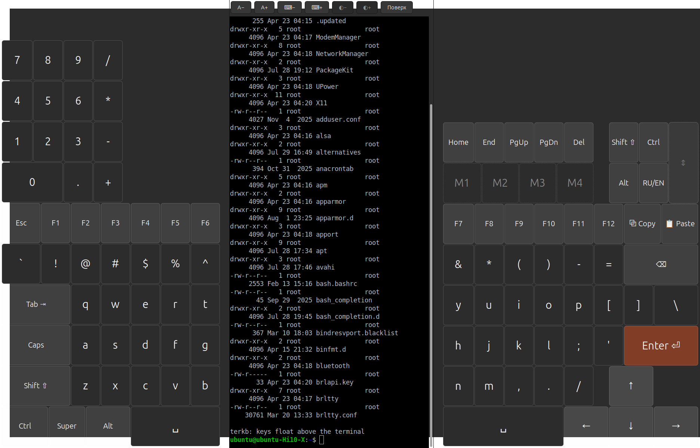
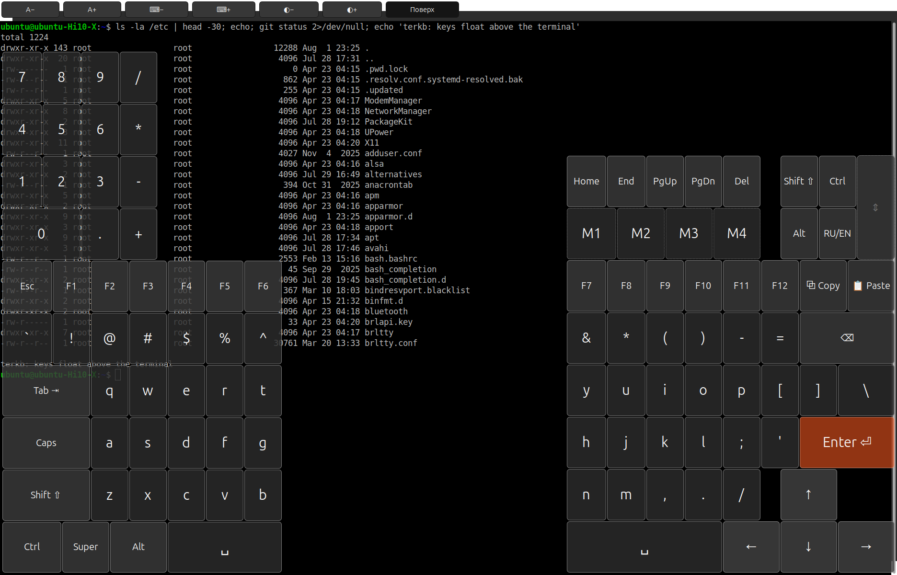

# terkb — терминал со сплит-клавиатурой

Сделано для планшета под Ubuntu, где физической клавиатуры нет. Половины
клавиатуры прижаты к краям экрана, терминал между ними: планшет держат двумя
руками и набирают большими пальцами.

Раскол по классическому месту — между `T` и `Y`, `G` и `H`, `B` и `N`.
Над левой половиной цифровой блок. Стрелки — в двух нижних рядах правой
половины, под большим пальцем; модификаторы и смена языка подняты наверх, на
освободившееся место: их жмут раз в несколько символов, а стрелками в
терминале работают постоянно.

Цифры набираются только на цифровом блоке. Ряд под F-клавишами отдан
символам: `` ` `` `!` `@` `#` `$` `%` `^` `&` `*` `(` `)` `-` `=` печатаются
без Shift, а под Shift на них лежат соответствующие цифры.



Модификаторы у половин общие: нажали `Shift` слева — он подсветится и
сработает на клавише справа.

## Режим наложения

Кнопка `Поверх` растягивает терминал на всё окно, а половины клавиатуры
кладёт поверх него полупрозрачными. Полезно, когда нужно видеть широкий
вывод целиком, не убирая клавиатуру.



Половины прижаты к нижнему краю и занимают ровно свою высоту, а не всё окно:
у ребёнка `Gtk.Overlay` собственное `GdkWindow`, и всё, что он накрывает,
перестаёт нажиматься — растянутая на всю высоту половина забирала бы касания
у верхних строк терминала. Панель кнопок лежит выше оверлея и перекрыть её
половины не могут в принципе.

Размер клавиатуры здесь меняется кнопками `⌨−` / `⌨+`. Расти ей позволено,
пока она не упрётся в высоту окна или пока половины не сойдутся посередине;
на упоре масштаб дальше не копится, иначе `⌨+` жалось бы вхолостую, а потом
`⌨−` несколько раз без реакции.

Плотность правится кнопками `◐−` / `◐+` в пределах `GHOST_ALPHA_MIN`…`MAX`.
Стартовое значение `GHOST_ALPHA` (`0.82`) подобрано замером: под клавишами идёт текст терминала, и при большей прозрачности он
начинает спорить с подписями — на плотном тексте контраст подписи к самому
светлому пикселю фона падает с 3.5x до 2.2x.

## Клавиатуру можно убрать

Кнопка `Скрыть ⌨` вынимает клавиатуру из окна целиком: терминал занимает всё
место. Пригождается, когда к планшету подключили настоящую клавиатуру или
когда надо прочитать длинный вывод — в отличие от наложения, экран не занят
даже полупрозрачными клавишами.

Пока клавиатура убрана, `Поверх` и `⌨−`/`⌨+` выключены: накладывать и
масштабировать нечего. Поворот в это время не возвращает клавиатуру, но
запоминается — по нажатию `Вернуть ⌨` появится та раскладка, которая положена
текущей форме окна.

Какая клавиатура висит в дереве виджетов, решает один метод `mount_keyboard`:
он снимает все три и вешает нужную. Режимы (скрыто, портрет, наложение) — это
просто флаги, по которым он выбирает.

## Поворот экрана

Планшет, повёрнутый вертикально, держат иначе: одной рукой снизу или лёжа на
столе, а печатают указательным пальцем. Раскол под большие пальцы там только
мешает — окно узкое, и половины сходятся посередине. Поэтому в портрете
клавиатура становится обычной: сплошная ANSI-раскладка во всю ширину под
терминалом.

Ориентация определяется по форме окна (`h > w`), а не по монитору: композитор
поворачивает экран, окно приезжает узким и высоким — тот же признак работает и
когда окно просто вытянули мышью. Квадрат остаётся за сплитом. Проверка живёт
в `check_orientation` и вызывается из `relayout`, поэтому срабатывает и там,
где `size-allocate` окна не приходит — например в тестах.

Переключение ничего не пересобирает: все три раскладки построены при запуске,
меняется только то, что висит в дереве виджетов. Состояние — модификаторы,
`Caps`, язык, команды `M1`…`M4` — общее, оно живёт в `KeyState`, куда клавиши
прописываются при сборке. Поэтому `Shift`, нажатый на цельной клавиатуре,
работает точно так же, как на половине.

Цифровой ряд у цельной раскладки другой: основными стоят цифры, а символы
уходят под `Shift`, как на настоящей клавиатуре. В сплите наоборот — там цифры
есть на отдельном блоке, и верхнему ряду достались символы.

В портрете нечего накладывать и нечего масштабировать: терминал и так во всю
ширину, а размер клавиш задан шириной окна. Кнопки `Поверх` и `⌨−`/`⌨+`
на это время выключаются. Если клавиатура упирается в `FULL_MAX_H` (55% высоты
окна), она становится уже полной ширины и встаёт по центру — клавиши лучше
помельче, чем терминал в три строки.

## Почему не хватило готовых решений

| Что есть | Чем не подошло |
|---|---|
| [kterm](https://github.com/bfabiszewski/kterm) | Единственный близкий аналог: VTE + встроенная клавиатура. Но клавиатура только снизу и целиком, писался под Kindle Touch, раскладки в XML от matchbox-keyboard |
| [Onboard](https://github.com/onboard-osk/onboard) | Под Wayland работает только через XWayland и с багами |
| [squeekboard](https://gitlab.gnome.org/World/Phosh/squeekboard) | Только Phosh |
| wvkbd | Только wlroots-композиторы (Sway/Hyprland), не GNOME |
| Встроенная OSK в GNOME | Всплывает снизу поверх окна, перекрывает терминал, нет F1–F12 и нормальных Ctrl/Alt |

Все внешние клавиатуры упираются в одну и ту же проблему: под Wayland нельзя
просто так вставить ввод в чужое окно. **Здесь этой проблемы нет** — клавиатура
и терминал живут в одном процессе, и ввод отдаётся VTE-виджету напрямую.
Ни `ydotool`, ни `uinput`, ни прав root не нужно.

## Запуск

```bash
./terkb-run
```

Или, если каталог с исходниками уже на пути импорта:

```bash
python3 -m terkb
```

Добавить в меню приложений:

```bash
./install.sh
```

Вместе с ярлыком ставится иконка — в пользовательскую тему `hicolor`, откуда
её берут меню, панель задач и переключатель окон.

Убрать оттуда:

```bash
./install.sh --uninstall
```

## Иконка

`icons/terkb.svg` — то же, что видно в окне: две половины клавиатуры по краям,
тёмное окно терминала между ними, зелёное приглашение внутри.

Рядом лежат растровые копии `icons/terkb-<размер>.png`. Они не для красоты:
SVG-загрузчик gdk-pixbuf стоит не в каждой системе (в этой, например, не
стоит), и без PNG иконка молча не показывается. Собираются они из того же
рисунка:

```bash
python3 icons/make-icons.py
```

Начиная с 48 пикселей рисунок полный; ниже — упрощённый: строки вывода и пять
клавиш на половину на такой сетке сливаются в грязь, поэтому там остаются
крупное приглашение и по три клавиши с каждой стороны. Правя `terkb.svg`,
править надо и `make-icons.py` — картинки держатся врозь намеренно, чтобы не
тянуть в зависимости конвертер SVG.

Приложение ставит иконку окна само: установленное — по имени из темы, а
запущенное из каталога с исходниками — файлом рядом с пакетом.

## Зависимости

Всё уже есть в стандартной Ubuntu: `python3-gi`, `gir1.2-gtk-3.0`,
`gir1.2-vte-2.91`. Ничего доустанавливать не нужно.

## Что умеет

* **Печать** — латиница и кириллица, переключение кнопкой `RU/EN`.
* **Смена раскладки при повороте** — в портрете сплит уступает место обычной
  цельной клавиатуре, см. ниже.
* **Модификаторы `Ctrl` / `Alt` / `Shift` / `Super`** — трёхпозиционные:
  первое нажатие — на одну клавишу (подсветка синим), второе — фиксация
  (подсветка оранжевым), третье — выключить. Так `Ctrl+C` нажимается двумя
  касаниями, а не одновременным нажатием двух клавиш.
* **`Caps`** — фиксация регистра.
* **Стрелки** «перевёрнутым Т» в двух нижних рядах правой половины, у самого
  края — там лежит большой палец. Каждая в полтора раза шире обычной клавиши.
* **`Shift` / `Ctrl` / `Alt` / `RU-EN`** правой половины — блоком 2×2 сверху,
  клавишами обычного размера. `Shift`, `Ctrl` и `Alt` есть и в левой половине,
  на привычных местах.
* **Цифровой блок** над левой половиной — единственное место, где набираются
  цифры.
* **Автоповтор** при удержании стрелок, `Backspace` и обычных символов.
* **Правильные escape-последовательности.** Специальные клавиши уходят в VTE
  синтезированным GDK-событием, а не заранее записанными байтами, поэтому
  стрелки работают и в обычной оболочке, и в `vim`/`less`, которые переключают
  терминал в application cursor mode и ждут `ESC O A` вместо `ESC [ A`.
* **`Copy` / `Paste`** — на планшете без клавиатуры добраться до буфера обмена
  иначе тяжело.
* **`A−` / `A+`** — размер шрифта терминала.
* **Кнопка схемы** (`Dracula`, `Gruvbox`, …) — цветовая схема по кругу, см.
  ниже.
* **Кнопка шрифта** (`Моно`, `Ubuntu`, …) — моноширинный шрифт терминала по
  кругу. Неактивна, если в системе стоит только один.
* **`⌨−` / `⌨+`** — размер самой клавиатуры. В режиме наложения это
  единственный способ её изменить: разделителей там нет. В обычном режиме
  кнопки переставляют разделители, подвинуть их потом руками всё равно можно.
* **`Home` / `End` / `PgUp` / `PgDn` / `Del`** — в верхней части правой
  половины.
* **Восемь программируемых клавиш `M1`…`M8`** — четыре в правой половине и
  четыре широкие в левой, рядом с цифровым блоком. На клавише — имя записанной
  команды, см. ниже.
* **`🔍`** — поиск по выводу терминала, см. ниже.
* **`⛶`** — во весь экран, без заголовка окна.
* **Ссылки в выводе нажимаются** — открываются в браузере, см. ниже.
* **Полоса перемотки** у правого края: перетаскивание пальцем листает
  терминал. Кликов не шлёт — почему, см. ниже.
* **`◐−` / `◐+`** — плотность клавиш в режиме наложения: плотнее или
  прозрачнее. Вне режима кнопки неактивны — там менять нечего.
* **`Поверх`** — переключение в режим наложения и обратно.
* **`Скрыть ⌨`** — убрать клавиатуру совсем, терминал на всё окно. Повторное
  нажатие возвращает ту раскладку, которая положена по форме окна.
* **Оба разделителя перетаскиваются** — можно раздвинуть терминал или, наоборот,
  отдать больше места клавиатуре. Приложение пересчитывает раскладку только при
  смене размера окна и при переключении режима; перетаскивание после этого не
  трогается.

## Цветовые схемы

Восемь схем: `Система`, `Dracula`, `Gruvbox`, `Nord`, `Tokyo`, `Mocha`,
`Solar ◑` (Solarized Dark) и `Solar ◐` (Solarized Light). Переключаются одной
кнопкой по кругу: на планшете выбирать пункт из списка пальцем неудобно, а
кнопка сама показывает, что сейчас выбрано.

Схема красит не только терминал. Клавиши, панель, строка правки и полоса
прокрутки берут цвета оттуда же — иначе тёмный терминал сидит в светлой рамке
системной темы, и окно выглядит склеенным из двух программ. Оттенки клавиш
считаются от фона схемы к её тексту ступенями (`skin_colors`): панель чуть
отходит от фона, обычная клавиша — от панели, служебная — от обычной. Так одна
пара цветов задаёт всю раскраску, и добавить схему — это дописать словарь
в `SCHEMES`.

`Система` — отдельный случай: своих цветов у неё нет, VTE и клавиатура
работают на теме GTK, как до появления схем.

Терминалу схема отдаёт все 16 ANSI-цветов, курсор и цвет выделения. Курсор —
блок, а текст под ним перекрашивается в цвет фона: иначе не видно, какая под
курсором буква.

Выбранная схема, шрифт и его размер лежат в `~/.config/terkb/settings.json` и
переживают перезапуск. Битый файл не роняет запуск — берутся значения по
умолчанию.

## Программируемые клавиши

Восемь клавиш `M1`…`M8`: четыре в верхней части правой половины и четыре
в левой, справа от цифрового блока, по одной на ряд — там всё равно пустовало
13 четвертей на четыре ряда. Левые получились втрое шире обычной клавиши, и
имя команды на них читается целиком. В портрете все восемь стоят в верхнем
ряду цельной раскладки. Короткое нажатие выполняет записанную команду (текст
плюс `Enter`), долгое — открывает строку правки. Пустая клавиша нарисована
пунктиром и по короткому нажатию тоже предлагает себя заполнить.

На клавише написано имя команды, а не вся строка: целиком она не влезает и
обрезалась многоточием на втором символе. `sudo apt update` подписывается как
`apt`, `./deploy.sh --now` — как `deploy.sh`; служебные слова (`sudo`, `env`,
`nohup`, присваивания переменных) пропускаются. Полная команда — в подсказке.

Строка правки встроена в окно над терминалом, а не сделана диалогом: модальное
окно перекрыло бы клавиатуру, которой и надо набирать. На время правки ввод
подменяется — вместо терминала он идёт в поле (`EntrySink` с тем же
интерфейсом, что у `Terminal`). Работают печать, `Backspace`, `Del`, стрелки,
`Home`/`End`, `Paste`; `Enter` сохраняет, `Esc` отменяет.

Команды хранятся в `~/.config/terkb/macros.json` и переживают перезапуск.
Битый файл не роняет запуск — клавиши просто окажутся пустыми.

## Поиск по выводу

Кнопка `🔍` открывает строку поиска — устроена так же, как строка правки
макроса: встроена в окно и на время поиска забирает ввод с экранной
клавиатуры, иначе набирать запрос было бы нечем. `↑` идёт к более раннему
совпадению, `↓` — к более позднему, `Enter` повторяет поиск вверх, `Esc`
закрывает.

Запрос ищется как обычный текст: он экранируется перед тем, как уйти в VTE.
Регулярные выражения на экранной клавиатуре всё равно никто набирать не
станет, а точка и звёздочка в запросе — обычное дело. Перемотка по кругу
включена, так что поиск не упирается в начало буфера.

## Ссылки в выводе

Адреса в выводе нажимаются пальцем и открываются в браузере: выделить ссылку
в VTE на тачскрине толком не выходит, а перенабирать её вручную — занятие
на любителя. Распознаются `http`, `https`, `ftp`, `file`, адреса вида
`www.…` (к ним приписывается `https://`) и почта (открывается почтовиком).
Хвостовая пунктуация отсекается: точка или запятая в конце предложения в
адрес не входят.

Кроме поиска по тексту включён OSC 8 — программы вроде `ls` или `gh` отдают
ссылку отдельной последовательностью, и угадывать её по виду не нужно.

## Свои раскладки

Раскладки можно описать файлом и не трогать Python:

```bash
terkb --dump-layout
```

Команда пишет `~/.config/terkb/layout.json` со всеми тремя встроенными
раскладками — дальше файл правится руками. Каждая клавиша это объект с видом
(`char`, `key`, `mod`, `action`, `macro`, `raw`), подписью, местом в сетке
(`x`, `y`) и размером в четвертях (`w`, `h`); у печатных есть пара `ru` с
кириллическими подписями, у специальных — `keyval` с именем клавиши GDK
(`Return`, `BackSpace`, `Page_Up`, `F7`, `Up`). Место полосы перемотки задаёт
`touchpad`.

Ошибка в файле не оставляет без клавиатуры: terkb говорит, что именно не
так, и собирает встроенную раскладку — причём только ту, в которой ошибка,
остальные берутся из файла. Удалить файл — вернуться к встроенным.

## Полоса перемотки

Узкая полоса у самого правого края верхней части правой половины — в одну
клавишу шириной и в две высотой. Блок модификаторов стоит слева от неё.

Перетаскивание пальцем листает терминал, как на телефоне: тянешь вниз —
уходишь к более ранним строкам. Больше она ничего не делает: ни курсора,
ни кликов.

Кликов нет не из лени, а из-за упора в VTE.

**Что проверено.** Синтетические события указателя до VTE доходят — счётчики
на `button-press-event` / `motion-notify-event` показали 1 нажатие, 9 движений
и 1 отпускание, — но выделение не возникает. Пробовал три способа доставки:
`widget.event()`, `Gtk.main_do_event()` и `Gdk.Display.put_event()`, в
настоящем окне и с фокусом у терминала. Внутренние жесты VTE требуют
настоящего захвата устройства от композитора, подделать это из приложения
нельзя.

Прокрутка же идёт мимо событий — прямо через `vadjustment`, — и работает
всегда — на ней полоса и держится.

Отправлять мышиные escape-последовательности прямо в PTY можно, и `vim`,
`htop`, `mc`, `tmux` их поймут. Но узнать, включило ли приложение режим мыши,
VTE не даёт — ни свойства, ни сигнала, ни метода. Вне такого приложения тап
насыпал бы в приглашение мусор вроде `0;35;12M`, поэтому кликов нет.

## Подсветка нажатия

Нажатие показывается своим классом `.kb-hit`, а не состояниями GTK. Причин две.

Во-первых, правило темы `button:hover` со специфичностью (0,1,1) перебивает наш
одноклассовый `.kb-key`, и на тачскрине подсветка залипала: после касания
виджет нередко остаётся в prelight, потому что события «указатель ушёл» не
приходит. Поэтому все состояния (`:hover`, `:active`, `:checked`, `:focus`)
в таблице перечислены явно и выглядят одинаково.

Во-вторых, класс снимается не только по отпусканию, но и по таймауту
(`HIT_TIMEOUT_MS`) — если состояние почему-то не снимется, подсветка уйдёт
сама.

**Зона изменения размера.** Окно-ручка `GtkPaned` шириной 9 px наезжало на
крайнюю клавишу у терминала: замер показал перекрытие `F7` на 4 px. Касание
уходило на перетаскивание разделителя, а не на клавишу — подсветка не
загоралась, нажатие терялось. Поэтому со стороны терминала у каждой половины
есть зазор `HANDLE_GUARD`; после него запас до ручки — 24 px слева и 16 px
справа.

Ведётся подсветка от флага `ACTIVE` самой `GtkButton`, а не от нашего жеста.
Жест живёт в фазе CAPTURE, и у клавиш рядом с терминалом до подсветки он не
доходил, хотя нажатие срабатывало. Флаг `ACTIVE` ставит сама кнопка — та же
машинерия, что даёт `clicked`, поэтому загорается везде, где клавиша вообще
нажимается. Жест остался только у клавиш с автоповтором и только ради
повтора.

Отдельно от этого работает подсветка модификаторов: синяя — нажат на одну
клавишу, оранжевая — зафиксирован. Она держится намеренно и снимается
следующим нажатием.

## Про размер клавиш

На экране 1920×1200 при 10.1″ получается примерно 8.82 px/мм. Половинам
отводится 68% ширины окна, отсюда клавиша **82.8 px ≈ 9.4 мм** — как раз
комфортный размер для пальца (обычно считают от ~9 мм). Терминалу остаётся
600 px, около 75 колонок.

Ширины половин подобраны так, чтобы клавиши в обеих получились одинаковыми:
правой достаются `Backspace`, `Enter` и правый `Shift`, поэтому она шире левой
(34 против 29 «четвертей клавиши») и ширину окна делит в той же пропорции.
Размер клавиши ограничивается и по высоте — иначе на низком окне половины
ужались бы по-разному и клавиши разъехались. Высота считается за вычетом
панели кнопок: она лежит над клавиатурой во всю ширину окна. Пока панель не
размещена, её высота берётся из `get_preferred_height_for_width` — по нулевой
аллокации раскладка сошлась бы на завышенном размере клавиши и половины
разъехались бы уже насовсем.

Это только начальное положение: разделители можно перетащить, и тогда размеры
половин станут такими, какими вы их поставите — до следующего изменения размера
окна.

## Настройка

Всё, что правится кнопками, само ложится в `~/.config/terkb/settings.json` и
переживает перезапуск: схема, шрифт и его размер, размер клавиатуры, плотность
клавиш в наложении, режимы «Поверх», «Скрыть ⌨» и полного экрана, размер окна.
Файл можно править и руками — значение, которое не проходит проверку
(не тот тип, вне допустимых границ), молча заменяется умолчанием, а битый файл
не мешает запуску.

Отдельно стоит `kb_fraction` — доля ширины окна под обе половины. Кнопки
`⌨−`/`⌨+` крутят множитель к ней, но если привычный размер сильно отличается
от стандартных 68%, проще вписать долю прямо в файл:

```json
{ "kb_fraction": 0.4 }
```

Остальное — константы в модулях пакета: размеры лежат в `terkb/geometry.py`,
схемы и шрифты — в `terkb/schemes.py`, пути и разбор настроек — в
`terkb/config.py`, ссылки — в `terkb/terminal.py`.

* `KB_FRACTION` — доля ширины окна под обе половины при первом запуске
  (по умолчанию `0.68`, остальное — терминал). Дальше она живёт в настройках.
* `KB_SCALE_STEP`, `KB_SCALE_MIN`, `KB_SCALE_MAX` — шаг и пределы кнопок
  `⌨−`/`⌨+`.
* `KB_MAX_TOTAL` — сколько ширины окна половины не имеют права занять вместе
  (по умолчанию `0.94`), чтобы не сойтись посередине.
* `KEY_STRETCH` — во сколько раз клавише разрешено быть выше своей ширины
  (по умолчанию `1.35`).
* `GHOST_ALPHA`, `GHOST_ALPHA_STEP`, `GHOST_ALPHA_MIN`, `GHOST_ALPHA_MAX` —
  стартовая плотность клавиш в режиме наложения, шаг и пределы кнопок
  `◐−`/`◐+`.
* `ARROW_W` — ширина клавиши-стрелки в четвертях.
* `MOD_W`, `MOD_H` — размер клавиши верхнего блока модификаторов.
* `HIT_TIMEOUT_MS` — через сколько подсветка нажатия снимается сама, если
  состояние не снялось.
* `HANDLE_GUARD` — зазор между клавишами и зоной изменения размера.
* `TOUCHPAD_ROWS`, `TOUCHPAD_W` — высота и ширина полосы перемотки.
* `SCROLL_SPEED` — во сколько раз прокрутка быстрее движения пальца.
* `PROG_KEYS`, `PROG_W` — сколько программируемых клавиш и какой ширины.
* `PROG_L_KEYS`, `PROG_L_W` — сколько из них уходит в левую половину и какой
  они там ширины (по умолчанию четыре во всю пустую зону рядом с цифровым
  блоком).
* `MACRO_FILE` — где хранятся их команды.
* `SCHEMES`, `DEFAULT_SCHEME` — цветовые схемы и та, что берётся при первом
  запуске.
* `FONT_CHOICES` — кандидаты в шрифты терминала. Список фильтруется по тому,
  что реально стоит в системе: циклер не должен листать пустоту.
* `FONT_MIN`, `FONT_MAX` — пределы кнопок `A−`/`A+`.
* `SETTINGS_SPEC` — что хранится в настройках: умолчание и проверка на каждый
  ключ.
* `SETTINGS_FILE`, `LAYOUT_FILE` — где лежат настройки и свои раскладки.
* `LINK_PATTERNS` — что считать ссылкой в выводе.
* `SPLIT_L_W`, `SPLIT_R_W` — ширины половин в «четвертях клавиши».
* `NUM_ROWS`, `ARROW_ROWS`, `MAIN_ROWS` — сколько рядов в каждом блоке.
* `FULL_W`, `FULL_ROWS` — размер цельной раскладки, которая включается в
  портрете.
* `FULL_MAX_H` — какую долю высоты окна ей разрешено занять (по умолчанию
  `0.55`).

Встроенные раскладки описаны функциями `build_left`, `build_right` и
`build_full`. Клавиша — это `C(...)` для печатного символа (с русской парой),
`K(...)` для специальной (по keyval из GDK), `M(...)` для модификатора,
`R(...)` для готовой последовательности байт, `A(...)` для действия
приложения, `P(...)` для программируемой. Чтобы переставить клавиши, код
трогать не обязательно — см. «Свои раскладки».

Состояние (модификаторы, Caps, язык) живёт в `KeyState` и общее для обеих
половин; каждая половина — это `KeyPad`, отдельная сетка кнопок.

## Из чего собран

```
terkb/
  geometry.py  размеры клавиатуры в «четвертях клавиши»
  schemes.py   цветовые схемы, работа с цветом, выбор шрифта
  styles.py    таблицы стилей GTK, в том числе собранные по схеме
  config.py    файлы в ~/.config/terkb: настройки, макросы, раскладки
  keys.py      клавиша, её запись в файле раскладки, общее состояние
  keypad.py    сетка клавиш, полоса перемотки
  layouts.py   встроенные раскладки и обмен с layout.json
  terminal.py  VTE и приёмник ввода для встроенных строк правки
  window.py    окно: панель, режимы, поиск, правка макросов
  app.py       приложение GTK, иконка и разбор командной строки
terkb-run      запуск из каталога с исходниками
icons/         иконка: terkb.svg, растровые копии и make-icons.py
```

Пути к файлам конфигурации и `HIT_TIMEOUT_MS` намеренно не вынесены в
`terkb/__init__.py`: их подменяют в тестах, а подмена работает только там, где
имя определено. Поэтому за ними ходят по месту — `terkb.config.MACRO_FILE`,
`terkb.keypad.HIT_TIMEOUT_MS`. Остальное публичное имя доступно и коротким
путём: `terkb.Window`, `terkb.SPLIT_L_W`, `terkb.dump_layouts`.

## Тесты

```bash
python3 tests/test_input.py
```

Тест поднимает окно в offscreen-режиме, программно «нажимает» клавиши и
проверяет, что настоящий шелл в терминале получил именно то, что нужно:
печать с обеих половин, `Enter`, `Shift` с одной половины на другую,
кириллицу, `Backspace`, `Tab`, историю по `↑`, движение курсора по `←`
и цифровой блок. Отдельно проверяется раскладка: терминал между половинами,
одинаковый размер клавиш слева и справа, отсутствие цифр в ряду под
F-клавишами при сохранности символов шелла, что стрелки крупнее обычных
клавиш, и что оба разделителя перетаскиваются. Для режима наложения
проверяется, что терминал занимает всё окно, половины переезжают поверх него
и получают класс прозрачности, размер клавиш не меняется, ввод и стрелки
продолжают работать, панель инструментов не перекрыта половинами, а выключение
режима возвращает всё на место. Для кнопок размера — что `⌨−` и `⌨+` реально
меняют клавиатуру, что на упоре половины не наезжают друг на друга и на панель
инструментов, и что масштаб не копится сверх достижимого. Для прозрачности —
что `◐−`/`◐+` меняют плотность, ограничены сверху и снизу и активны только в
режиме наложения. Для раскладки — что стрелки лежат в двух нижних рядах, `↑`
стоит ровно над `↓`, а модификаторы подняты наверх и оттуда работают. Для
подсветки — что prelight не меняет вид клавиши, что нажатие подсвечивается и
снимается, что оно уходит по таймауту без отпускания и что флаг `ACTIVE`
зажигает клавишу в обеих половинах — включая те, что стоят вплотную к
терминалу, и что крайние клавиши `F6`/`F7` не задеты зоной изменения размера. Для
программируемых клавиш — что их восемь и по умолчанию они пустые, что каждая
есть и в цельной раскладке, что нажатие пустой открывает правку, что
клавиатура при этом набирает в поле, а не в терминал, что `Backspace` там
работает, что `Enter` сохраняет и возвращает ввод в терминал, что подписью
стало имя команды (а полная ушла в подсказку) и что файл обновился, что
нажатие выполняет команду и что отмена не портит сохранённое. Для оформления —
что схема доезжает до терминала, перекрашивает клавиши и пишется в конфиг, что
у «Системы» цвета сброшены и что кнопка шрифта листает список и сохраняет
выбор. Для ссылок — что адрес распознаётся без хвостовой запятой, что почта
тоже распознаётся, а обычный текст ссылкой не считается. Для поиска — что
строка открывается и забирает ввод, что запрос набирается с клавиатуры и
доезжает до VTE, а закрытие возвращает ввод терминалу. Для поворота — что
узкое окно даёт цельную клавиатуру во всю ширину, а широкое возвращает сплит.
Для скрытия — что клавиатуры нет в дереве, терминал занимает всё окно, режимы
выключены, а поворот не возвращает клавиатуру. Для `Home` — что курсор уходит
в начало строки. Состояния сверяются
по пикселям отрисованного окна: `get_background_color` устарел и игнорирует
переданное состояние, по нему картина всегда выглядит исправной. Для полосы
перемотки — что её размер равен клавише в ширину и двум в высоту, что она
прижата к краю половины, а модификаторы слева от неё, что палец листает в обе
стороны и что долгая перемотка не вылезает за пределы буфера.

```bash
python3 tests/test_toggle_window.py
```

Отдельная проверка: восемь раз переключает режим наложения и следит, чтобы
половины не схлопывались, клавиши не разъезжались, а размеры одного и того же
режима повторялись. Открывает настоящее окно на экране — offscreen здесь
бесполезен: он раскладывается с первой попытки, а поломка возникала именно
там, где GTK сходится не сразу.

```bash
python3 tests/test_search.py
```

Поиск по выводу — тоже в настоящем окне: в offscreen VTE находит совпадение,
но не выделяет его и не прокручивает к нему. Проверяется, что метка,
уехавшая далеко в прокрутку, находится и выделяется, что вывод к ней
прокручивается, что выше совпадений больше нет, что перемотка по кругу
возвращает к ней при поиске вниз, что спецсимволы ищутся буквально и что
закрытие возвращает ввод терминалу.

```bash
python3 tests/test_layout.py
```

Раскладки из файла: что выгрузка и загрузка ничего не теряют, что дописанная
в файл клавиша появляется, что полоса перемотки встаёт куда указано, что
битый файл не оставляет без клавиатуры, что ошибка в одной раскладке не
утаскивает соседние и что негодные клавиши отвергаются с понятным сообщением.
Окно на экран не выводится — проверяются только собранные сетки клавиш.
